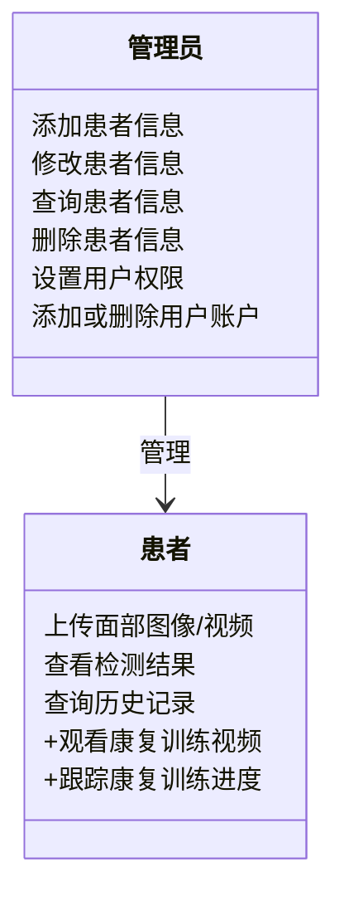

```mermaid
classDiagram  
    class 管理员 {  
        添加患者信息  
        修改患者信息  
        查询患者信息  
        删除患者信息  
        设置用户权限  
        添加或删除用户账户  
    }  
  
    class 患者 {  
        上传面部图像/视频  
        查看检测结果  
        查询历史记录  
        +观看康复训练视频  
        +跟踪康复训练进度  
    }  
  
    管理员 --> 患者 : 管理
```